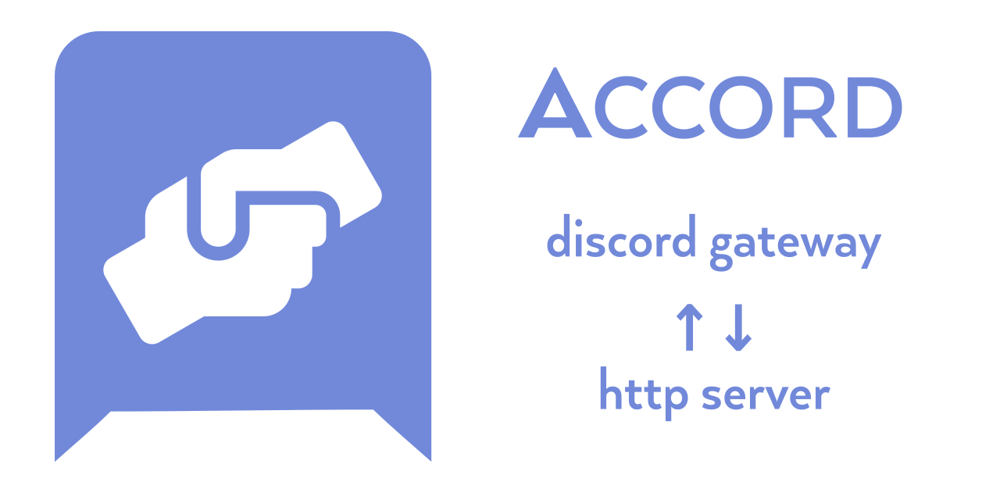

[](https://crates.io/crates/passcod-accord)
[](./LICENSE)


# 

- Status:
  + alpha
  + not production tested
  + covers only a [small](https://github.com/passcod/accord/issues/1) part of the API
- Releases:
  + see the [releases tab](https://github.com/passcod/accord/releases) for tagged releases
  + no pre-built binaries yet, build from source
  + or with `cargo install passcod-accord`
- License: [CC-BY-NC-SA 4.0](./LICENSE)
  + “Uhhh... this isn't a software license?”
  + Yes, but it still functions as a “work” license.
  + It may be changed later.
  + It's not open source!
  + Yes, this is by design.
  + What if I want to use it in a commercial context?
  + [See the top of the LICENSE file](./LICENSE)
- Contribute: you can!
  + Areas in need of love: everywhere.
  + More descriptive erroring and warnings would help lots!
  + Basic response timing stats could be helpful!
  + Anywhere there's a TODO comment...
  + Some example applications would be ace!
  + And of course, handling of more events is most welcome.

## Docs

To get started, stand up a server (for example, a PHP standalone server that
routes everything to `index.php`: `php -S 127.0.0.1:8080 index.php`) and add
its address to the `ACCORD_TARGET` environment variable.

Then add your bot's discord token to `DISCORD_TOKEN`, and start Accord.

Accord will now make a request to your server whenever an event occurs on
Discord that your bot can see.

Caveat (to be resolved): your bot currently needs to have the Members
[privileged intent][privileged] enabled. This will become configurable later.

[privileged]: https://discord.com/developers/docs/topics/gateway#privileged-intents

### Configuration

Done through environment variables.

| Name | Default | Purpose | Example |
|------|---------|---------|---------|
| `DISCORD_TOKEN` | **required** | Discord app token. ||
| `ACCORD_TARGET` | **required** | Base URL of the server to send Accord requests to. | `http://localhost:8080` |
| `ACCORD_BIND` | `localhost:8181` | Address to bind the reverse interface to. | `0.0.0.0:1234` |
| [`ACCORD_COMMAND_MATCH`](#commands) | _none_ | Regex run on messages to match (true/false) as commands. | `^~\w+` |
| [`ACCORD_COMMAND_PARSE`](#commands) | _none_ | Regex run on commands to parse them out (with captures). | `(?:^~\|\s+)(\w+)` |

### Events to endpoint table

| Event | Endpoint | Payload type | Responses allowed |
|-------|----------|--------------|-------------------|
| `MessageCreate` (from a guild) | `POST /server/{guild-id}/channel/{channel-id}/message` | [`Message`](#payload-type-message) | [`text/plain` reply content](#response-text-reply), [`application/json` acts](#response-json-acts) |
| `MessageCreate` (from a DM) | `POST /direct/{channel-id}/message` | [`Message`](#payload-type-message) | [`text/plain` reply content](#response-text-reply), [`application/json` acts](#response-json-acts) |
| `MessageCreate` (matching command regex) | `POST /command/{command...}` | [`Command`](#payload-type-command) | [`text/plain` reply content](#response-text-reply), [`application/json` acts](#response-json-acts) |
| `MemberAdd` | `POST /server/{guild-id}/join/{user-id}` | [`Member`](#payload-type-member) | [`application/json` acts](#response-json-acts) |
| `ShardConnected` | `POST /discord/connected` | [`Connected`](#payload-type-connected) | [`application/json` acts](#response-json-acts) |
| _before a connection is made_ | `GET /discord/connecting` | none | [`application/json` presence](#response-json-presence) |

### Payloads

All non-GET endpoint requests carry a payload, which is a JSON value of
whatever particular type the event generates (see the table). Some types have
subtypes, and so on. Types are given here in Typescript notation:

#### Payload type: `Message`

```typescript
{
  id: number, // u64
  server_id?: number, // always present for guild messages, never for DMs
  channel_id: number,
  author: Member | User, // Member for guild messages, User for DMs

  timestamp_created: string, // as provided from discord
  timestamp_edited?: string, // as provided from discord

  kind?: "regular", // usually "regular" (default), see source for others
  content: string,

  attachments: Array<Attachment>, // from twilight, type not stable/documented
  embeds: Array<Embed>, // idem
  reactions: Array<MessageReaction>, // idem

  application?: MessageApplication, // idem
  flags: Array<"crossposted" | "is-crosspost" | "suppress-embeds" | "source-message-deleted" | "urgent">,
}
```

#### Payload type: `Member`

```typescript
{
  user: User,
  server_id: number,
  roles?: Array<number>, // IDs of the roles
  pseudonym?: string, // Aka the "server nick"
}
```

#### Payload type: `User`

```typescript
{
  id: number, // u64
  name: string,
  bot: boolean,
}
```

#### Payload type: `Connected`

```typescript
{
  shard: number,
}
```

#### Payload type: `Command`

```typescript
{
  command: Array<string>, // captures from the ACCORD_COMMAND_PARSE regex
  message: Message,
}
```

### Headers

There are a set of headers, all beginning by `accord-`, that are set by events.
All the information in headers is also available in the payload (except for the
`accord-version` header, which is present on all requests but in no payload),
and these are intended less for the application (which should parse the payload
instead) and more for the request router (which might not posses the ability to
inspect bodies or parse JSON). For example, nginx could route DM events
(`accord-channel-type: direct`) to a different application.

 - `accord-version` — Always provided, the version of Accord itself;
 - `accord-server-id` — In guild context only;
 - `accord-channel-id` — In channel contexts;
 - `accord-channel-type` — `text` or `voice` in guilds, `direct` for DMs.
 - `accord-message-id` — In message contexts;
 - `accord-author-type` or `accord-user-type` — `bot` or `user`;
 - `accord-author-id` or `accord-user-id`;
 - `accord-author-name` or `accord-user-name`;
 - `accord-author-role-ids` or `accord-user-role-ids`;
 - `accord-content-length` — In message contexts, the length of the message.

### Statuses

The response status code is handled identically throughout:

 - 1xx are not supported unless curl handles them internally;
 - 204 and 404 abort reading the response and return without any further action;
 - multiple-choice (300) is not supported (but may be in future);
 - not-modified (304) is not supported _yet_;
 - redirects are handled internally by curl (limit 8);
 - proxy redirections (305 and 306) are unsupported;
 - error statuses (400 and above) log an error, and may do more later;
 - all other success statuses are interpreted as a 200, and handling continues as below:

### Responses

The response expected from any endpoint varies. Generally the body needs to be
JSON, but there are some endpoints that accept other types, like text, for
convenience.

The general JSON response format is called "act" and represents a single action
to be taken by Accord. An act is an object with one key describing its type,
and that particular act's properties as a child object.

The `content-type` header of the response must be `application/json` for that
format, and the JSON must contain no literal newlines (i.e. it can't be
"pretty" JSON).

Message create and command endpoints accept a `content-type: text/plain`
response and interpret it as a `message-create` act with the response's body as
content.

Multiple actions are possible with the JSON format by separating each act with
a newline (which is why individual acts can't span more than one line). An
empty line is ignored without error. Each line is parsed as an act and actioned
as soon as it is received, and the connection is kept open until EOL is
received, so you can stream multiple acts with arbitrary delays in-between, and
send "keepalives" to make sure the connection stays open in the form of
additional newlines. Lines are trimmed of leading and trailing whitespace
before parsing as JSON, so you can pad out your messages to ~4096 bytes to
reach buffering thresholds.

(For this reason, on top of simple performance concerns, your server _must_
support multiple simultaneous connections.)

A few endpoints have special formats and do not support JSON act.

#### Response: JSON acts

##### Act: `create-message`

Posts a new message.

```typescript
{ "create-message": {
  content: string,
  channel_id?: number, // u64 channel id to post in
} }
```

The `content` is internally converted to UTF-16 codepoints and cannot exceed
2000 of them (this is a Discord limit).

Channel IDs are globally unique, so there's no need to supply a server ID.
Accord will attempt to fill in the channel ID if not present in the act. In
order of precedence:

 - the act's `channel_id`
 - the response header `accord-channel-id`, if present
 - if the request is from a message context, that message's channel

##### Act: `assign-role`

Assigns a role to a member.

```typescript
{ "assign-role": {
  role_id: number,
  user_id: number,
  server_id?: number,
  reason?: string,
} }
```

Accord will attempt to fill in the server ID if not present in the act. In
order of precedence:

 - the act's `server_id`
 - the response header `accord-server-id`, if present
 - if the request is from a guild context, that guild

The `reason` string, when given, shows up in the guild's audit log.

##### Act: `remove-role`

Removes a role from a member.

```typescript
{ "assign-role": {
  role_id: number,
  user_id: number,
  server_id?: number,
  reason?: string,
} }
```

Accord will attempt to fill in the server ID if not present in the act. In
order of precedence:

 - the act's `server_id`
 - the response header `accord-server-id`, if present
 - if the request is from a guild context, that guild

The `reason` string, when given, shows up in the guild's audit log.

#### Response: text reply

In message create contexts (including commands), if a response has type
`text/plain` is is read entirely as a UTF-8 string, and then treated as a
single act with that string as content and no supplied `channel_id` (falling
back to context or headers).

#### Response: JSON presence

The `/discord/connecting` special endpoint is called _before_ the Accord
connects to Discord, and provides the opportunity to set the _presence_ of the
bot. That is, its "online / offline / dnd / etc" status, whether it's marked as
AFK, and what activity it's displaying, if any (the "Playing some game..."
message under a user).

It's not yet possible to change the presence while connected.

```typescript
{
  afk?: boolean,
  status?: "offline" | "online" | "dnd" | "idle" | "invisible",
  since?: number,
  activity?: Activity
}
```

The `Activity` type can be any one of:

```typescript
{ playing: { name: string } }   // displays as `Playing {name}`
{ streaming: { name: string } } // displays as `Streaming {name}`
{ listening: { name: string } } // displays as `Listening to {name}`
{ watching: { name: string } }  // displays as `Watching {name}`
{ custom: { name: string } }    // may not be supported for bots yet
```

### Commands

Message create events can go to either their generic endpoints or, if they
match and parse as a _command_, will go to the `/command/...` endpoint.

There are two (optional) environment variables controlling this:

 - `ACCORD_COMMAND_MATCH` does a simple regex test. If it matches, the message
   is considered a command, otherwise not.

 - `ACCORD_COMMAND_PARSE` (if present) is then run on the message, and all
   non-overlapping captures are collected and considered the "command" part of
   the message.

The endpoint is then constructed to `/command/` followed by the parsed and
collected "command" parts as above joined by slashes.

For example, `!pick me` could be parsed to the endpoint `/command/pick/me`, or
to `/command/pick`, or just to `/command/`, depending on what the parser regex
is or if it's present at all.

If `ACCORD_COMMAND_MATCH` is not present, then nothing will go to `/command/...`.

The regex engine is the [regex](https://docs.rs/regex) crate with all defaults.
You can use this online tool to play/test regexes: https://rustexp.lpil.uk

To get started, try these:

```
ACCORD_COMMAND_MATCH = ^!\w+
ACCORD_COMMAND_PARSE = (?:^!|\s+)(\w+)
```

### Reverse interface

Accord also has its own HTTP server listening, configured by the `ACCORD_BIND`
variable. This allows client-initiated functionality.

At the moment, only [Ghosts](#ghosts) are implemented.

### Ghosts

To act on Discord spontaneously, there are currently two options:

1. Make your own requests directly to Discord.
2. Create and respond to ghost events on the reverse interface.

Ghost events are events your application generates and sends to Accord, which
it then injects back into itself, as if they had come from Discord. Things
proceed as normal from there. Ghosts are never sent to Discord, and only exist
within the Accord instance they are sent to.

The primary purpose of ghosts is to initiate actions without external stimuli.
For example, a "clock" bot that posts a message every hour can summon, every
hour, a ghost that sends the message `!clock`. Your server will then receive a
request at `/command/clock`, answer appropriately, and Accord will post the
reply up on Discord.

Ghosts can also be used to invoke a command from another command. For example,
invoking `!roll 1-9` could detect that the arguments are more appropriate for
the `!random` command, and send a ghost containing `!random 1-9`. That may be
simpler than the alternatives (or it may not, exercise your own judgement).

To summon a ghost, you make a request to `{ACCORD_BIND}/ghost/{ENDPOINT}` where
`{ENDPOINT}` is the same endpoint [as in the forward
interface](#events-to-endpoint-table), containing the payload you would have
received from that endpoint. The main difference is that you don't need to set
any `accord-` headers (as there's no need to have them for routing). You also
don't need to set any payload field that is marked as optional.

For example, to send the `!clock` ghost as above, you would send a POST request
to `/ghost/server/123/channel/456/message` with the JSON body:

```json
{
  "id": 0,
  "server_id": 123,
  "channel_id": 456,
  "author": {
    "server_id": 123,
    "user": {
      "id": 0,
      "name": "a ghost"
    },
  },
  "timestamp_created": "2020-01-02T03:04:05Z",
  "content": "!clock"
}
```

The server and channel IDs in the body will be preferred to the ones in the
URL, but you should still set them correctly in the URL (for future
compatibility).

Currently only the following endpoints are implemented on the ghost interface:

- server messages: `/ghosts/server/{guild-id}/channel/{channel-id}/message`
- direct messages: `/ghosts/direct/channel/{channel-id}/message`

### Test facility

To test an Accord server implementation, you could write a harness that queries
your server, but as there's multiple ways to respond to achieve the same thing
in Discord, you would either start to replicate some Accord functionality just
to coalesce these forms, or you would make tests too strict.

Accord provides an `accord-tester` tool which works exactly the same as the main
program, and takes the same variables (to the exception of `DISCORD_TOKEN`),
except that instead of connecting to Discord, it only listens on the reverse
interface, and actions which would be taken on Discord are instead POSTed back
to your server to `/test/act` in normalised form.

Dealing with the asynchronicity and lack of relationship between requests and
received replies may be difficult; you can of course opt not to use this tool,
or to use it for some integration tests only.

## Credits

- The [logo](./logo.svg) is remixed from [the hands-helping solid Font Awesome icon](https://fontawesome.com/icons/hands-helping?style=solid), licensed under [CC-BY 4.0](https://fontawesome.com/license).

## Background and Vision

Accord is a Discord API client to power Discord API clients. Like bots. It is itself built on top of
the [Twilight] Discord API library. So, perhaps it should be called a middleware.

[Twilight]: https://github.com/twilight-rs/twilight

Accord is about translating a specialised interface (Discord's API) to a very common interface (HTTP
calls to a server), and back.

One thing I find when writing Discord bots is that a lot of logic that is already reliably
implemented by other software a lot older than Discord itself has to regularly be reimplemented for
a bot's particular usecase... and I'd rather be writing business logic.

Another is that invariably whenever I start a Discord bot project I end up wanting to write some
parts of it in a different language or using a different stack. If I had Accord, I could.

So, in Accord, a typical interaction with a bot would go like this:

1. Someone invokes the bot, e.g. by saying `!roll d20`
2. Discord sends Accord the message via WebSocket
3. Accord makes a POST request to `http://localhost:1234/server/123/channel/456/message` with the
   message contents as the body, plus various bits of metadata in the headers
4. Your "bot" which is really a server listening on port 1234 accepts that request, processes it
   (rolls a d20) and returns the answer in the response body with code 200
5. Accord reads the response, sees it means to reply, adds in the channel and server/guild
   information if those weren't provided in the response headers
6. Accord posts a message to Discord containing the reply.

You don't need to have your bot listen on port 1234 itself. In fact, that is not recommended. What
you should do instead is run it behind nginx. Why? Let's answer with another few scenarios:

- What if the answer to a command is always the same?

  Instead of having an active server process and answer the same thing every time, write an nginx
  rule to match that request and reply with the contents of a static file on disk.

- What if the answer changes infrequently?

  Add a cache. This is built-in to nginx in a few different ways, or use Varnish or something.

- What if the answer is expensive, and/or you don't want it abused?

  Add rate limiting. This is built-in to nginx.

- What if you want to scale out the amount of backends?

  Scale horizontally, use nginx's round-robin upstream support.

- What if you want to partially scale *in*, for example because you serve lots of guilds and need to
  shard for your expensive endpoints, but your cheap endpoints are perfectly capable of handling the
  load?

  Point your sharded Accords to their own nginxes, and forward cheap requests to one backend server.

There are many more fairly common scenarios that, in usual Discord bots, would require a lot of
engineering, but with the Accord approach, **are already solved**.

Okay, but, that may work well for query-reply bots, but your bot needs to reply more than once, or
needs to post spontaneously, for example in response to an external event.

There are four approaches with Accord.

1. Do the call yourself. Have a Discord client in your app that calls out. Accord doesn't (and
   cannot) stop you from doing this.

2. Use the reverse interface. Accord exposes a server of its own, and you can make requests to that
   server to use Accord's Discord connection to make requests. Accord adds authentication to Discord
   on top, so you don't need to handle credentials in two places.

3. Summon a ghost. You can make a special call via the reverse interface mentioned above that will
   cause Accord to fire a request in the usual way, as if it was reacting to a message or other
   Discord action, but actually that message or action does not exist. In that way you can
   implement code all the same, and take advantage of the existing layering (cache etc).

4. In the special case of needing to answer multiple times in response to an event, you can respond
   using chunked output, keep the output stream alive with null bytes sent at 30–60s intervals, and
   send through multiple payloads separated by at least two null bytes. The payloads will be sent
   as soon as each one is received.

What if you need to stream some audio to a voice channel?

- You can stream audio, in whatever format Accord supports (and it will transcode on the fly if it's
  not something Discord supports), as the response.

- You can reply with a 302 redirect to a static audio file, and Accord will do the same (but it
  might be a little more clever in regards to buffering if it detects it can do range requests).
  You can even redirect to an external resource (not recommended, for security and performance
  reasons... but you can do it).

### Beyond Discord

This... is only the beginning.

Because Discord is one thing, but what if you had this same kind of gateway for Twitter? Matrix?
Zulip? IRC? Slack? Email? etc

All these have anywhere from slightly to majorly different models in how they operate, but you still
have a core mechanic of posting messages and expecting answers. You'll probably have subtleties and
adaptations, but what if you could reuse vast swathes of functionality by _rewriting some routes_?

The first example above, a bot that rolls a die, could be the exact same backend program served for
Slack and for Discord. At the same time, and in parallel, you could have a Discord-specific voice
endpoint, and a Slack-specific poll endpoint.

### Isn't this really inefficient?

Yeah, kinda. Instead of a bot that interacts directly with Discord, you have at least two additional
layers. All that adds is a few tens of milliseconds. What you _gain_ is likely worth it. By a lot.


